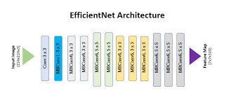

# Computer Vision

Classification convolutional neural network developed by me and called `TelesNet`. Which the use is to classify the gesture inserted in a game of rock, paper and scissors.

## How to use

### Before start

- First you must download the model in this link of google [drive](https://drive.google.com/drive/folders/1b1NAXEL4RzOI6kRLKG2i2qZrsQ7kbubx?usp=sharing). And then create a folder called `models/` and put the file into the folder.

- Install the dependencies using:

```bash
# Install dependencies
$ pip install -r requirements.txt

```

> If you running in windows, maybe you'll have a problem to install scikit lib so i recommend you to use pipwin:

```bash
# Install pipwin
$ pip install pipwin
|----------------| 100%

$ pipwin install scikit-learn
|----------------| 100%

$ pipwin install scikit-image
|----------------| 100%

```

### Play()

After that you can use the method `play()` to open the web cam and make the model try to discover the hand gesture that could be _rock, paper or scissors_.

```python
from TelesNet import TelesNet

model = TelesNet()

model.play()

```

> Obs: The model was trained with images on a green background, so for the model to have a better chance of getting the gesture right, make sure the hand is appearing behind a clean environment, such as a white wall or a green screen.

When the method is running will be two commands:

- Close the window `(Press Q)`
- Classify the gesture `(Press C)`


### Train()

Before train the model, it is necessary to call the `setData` function to insert the training data. An example of data is a array with images and labels of each image in the same index.

> Example:

```python
# Load data
data, labels = load_data()

# Use the setTrain method
model.setData(data, labels, numClasses=2, classes=["cat","dog"])

# Choose a version
model.buildModel("v1")

# Train
model.train()

```

## Models

Visualization of networks in an understandable way.

### V1


### V2


### V3

Transfer learning from EfficientNet



## Training
The training was carried out with x images and therefore a batch size of 64 was chosen. In addition to the models, a DataAugmentation was also implemented with a focus on contrast so that the model generalizes well with a background of any color. The training lasted 50 epochs and the metrics chosen for evaluation were precision, recall and accuracy.

### Results

|   | Metric | Value |
|---|---|---|
| Conteúdo da célula 1 | Conteúdo da célula 2 | Conteúdo da célula 3 |
| Conteúdo da célula 4 | Conteúdo da célula 5 | Conteúdo da célula 6 |
